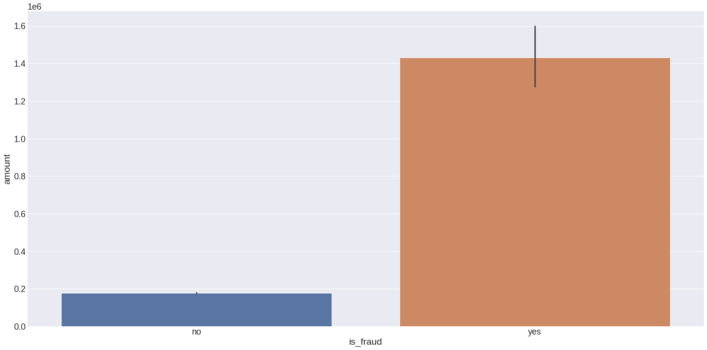

# Transaction Fraud Detection

a data science endeavour to identify fraudulent transactions in transactions.

    

 

## 1.0 Business Issue

A firm called The Blocker Fraud firm specialises in identifying fraudulent activity in financial transactions conducted via mobile devices. The business offers a service dubbed "Blocker Fraud" that ensures fraudulent transactions are blocked.

In other words, the user pays a set charge based on the firm's ability to identify fraud in the customer's transactions. The business model of the company is of the service type, with monetization made by the performance of the service supplied.

But the Blocker Fraud Company is growing in Brazil, and in order to get clients faster, it has taken a more aggressive approach. The following is how the approach operates:

1. The business will get 25% of the amount of any transaction that is really shown to be fraudulent;
2. In the event that a transaction is found to be fraudulent but is actually valid, the firm will be paid 5% of the total amount.
3. In the event that a transaction is found to be fraudulent but is actually legitimate, the business will reimburse the consumer 100% of the purchase price.

By using this aggressive approach, the business pays for forceful fraud detection and takes on the risks of not detecting fraud.

The business depends solely on the precision and accuracy of the models created by its Data Scientists; in other words, the more accurate the "Blocker Fraud" model, the higher the revenue, in addition to gaining a large number of clients with this risky strategy to ensure reimbursement in the event that customer fraud is not detected. However, the business can suffer a significant loss if the model is inaccurate.

## 2.0 Commercial Presumptions

The use of a strategy to identify fraudulent transactions or banking activities and stop them from harming a client's or financial institution's reputation is known as fraud prevention.

Financial scams are a constant and can occur both physically and virtually. Thus, there has been a rise in security investment.

As per [Febraban&#39;s 2020 Banking Technology Survey](https://blog.simply.com.br/tecnologia-bancaria-2020/), the amount of money that institutions invest annually on technology systems targeted at information security is half of the losses generated by fraud, which can amount to R\$ 1 billion.

## 3.0 Approach to Resolution

The creation of a data science project is how I plan to address this issue. A machine learning model developed for this research will be able to determine if a transaction is fraudulent or not.

**Step 1: Data Synopsis** Data collection and analysis will be place in this initial stage. Threats or removals will be applied on the absent values. In order to understand the data, a preliminary data description will be completed. As a result, several descriptive statistics calculations will be performed, including those for kurtosis, skewness, media, fashion, median, and standard deviation.

**Step 02: Engineering Features:** To help with the formulation of the hypothesis and the development of additional features, a mind map will be made in this part. These presumptions may raise the model scores and aid in exploratory data analysis.

**Step 3: Filtering Data:** To exclude rows or columns that are not relevant to the company, apply data filtering. Columns containing customer IDs, hashes, or rows containing ages that don't correspond to human ages are a few examples.

**Section 04: Investigative Data Examination:** To aid in comprehending the database, the exploratory data analysis section includes univariate, bivariate, and multivariate analyses. The bivariate analysis will examine the hypothesis that was developed in step 02 of the process.

**Step 5: Preparing Data:** The data will be ready for machine learning modelling in this fifth stage. They may thus be encoded, oversampled, subsampled, or rescaled in order to enhance the machine learning model's learning process.

Step 06: Choosing Features Following the data preparation in this step, algorithms such as Boruta will choose the optimal columns to be utilised in the machine learning model's training. As a result, there is less likelihood of overfitting and the database has fewer dimensions.

**Step 07: Modelling using Machine Learning:** Training the machine learning algorithms and their ability to predict data is the goal of step 7. To determine the model's learning potential, it is trained, validated, and then subjected to cross-validation.

**Step 08: Fine-tuning the Hyparameter** After choosing the appropriate model to use for the project, it's critical to fine-tune the parameters to increase the model's scores. The model performance techniques that were used in step 07 include

**Step 09: Final Thoughts:** In this final step, the generating capacity model is evaluated with hypothetical data. Furthermore, a few business-related queries are addressed to demonstrate the model's suitability in a corporate setting.

**Material Deployment Step 10:** This completes the data science project's last phase. Thus, the model and functions are stored to be implemented in the Flask API, and the Flask API is built in this phase.

## 4.0 Top 3 Informational Snapshots

* #### The total scam amount exceeds 10,000.

  **ACTUAL:** There are figures in excess of 10,000. It's crucial to remember, though, that the no-fraud values are also higher than 100,000.

  
* #### Cash-out methods account for 60% of fraud transactions.

  **FALSE:** The fraudulent transaction involves a cash-out and transfer type. They virtually have the same worth, though.

  
* #### Values greater than 100.000 occours using transfers-type method.

  **FALSE:** The majority transactions occours in trasnfer-type, however transactions greater than 100.000 occour in cash-out and cash-in too.

  

## 5.0 Machine Learning Applied

Here's all cross validation results of the machine learning models with their default parameters. The cross validation method is important to show the capacity of the model to learn.

#### Dummy Model

| Balanced Accuracy |  Precision  |   Recall   |     F1     |     Kappa     |
| :---------------: | :---------: | :---------: | :---------: | :------------: |
|   0.499 +/- 0.0   | 0.0 +/- 0.0 | 0.0 +/- 0.0 | 0.0 +/- 0.0 | -0.001 +/- 0.0 |

#### Logistic Regression

| Balanced Accuracy |  Precision  |     Recall     |       F1       |      Kappa      |
| :---------------: | :---------: | :-------------: | :-------------: | :-------------: |
|  0.565 +/- 0.009  | 1.0 +/- 0.0 | 0.129 +/- 0.017 | 0.229 +/- 0.027 | 0.228 +/- 0.027 |

#### K Nearest Neighbors

| Balanced Accuracy |    Precision    |     Recall     |       F1       |      Kappa      |
| :---------------: | :-------------: | :-------------: | :-------------: | :-------------: |
|  0.705 +/- 0.037  | 0.942 +/- 0.022 | 0.409 +/- 0.074 | 0.568 +/- 0.073 | 0.567 +/- 0.073 |

#### Support Vector Machine

| Balanced Accuracy |  Precision  |     Recall     |        F1        |      Kappa      |
| :---------------: | :---------: | :------------: | :--------------: | :-------------: |
|  0.595 +/- 0.013  | 1.0 +/- 0.0 | 0.19 +/- 0.026 | 0.319 +/- 0.0373 | 0.319 +/- 0.037 |

#### Random Forest

| Balanced Accuracy |    Precision    |     Recall     |       F1       |      Kappa      |
| :---------------: | :-------------: | :-------------: | :-------------: | :-------------: |
|  0.865 +/- 0.017  | 0.972 +/- 0.014 | 0.731 +/- 0.033 | 0.834 +/- 0.022 | 0.833 +/- 0.022 |

#### XGBoost

| Balanced Accuracy |    Precision    |     Recall     |       F1       |     Kappa     |
| :---------------: | :-------------: | :-------------: | :------------: | :------------: |
|  0.88 +/- 0.016  | 0.963 +/- 0.008 | 0.761 +/- 0.033 | 0.85 +/- 0.023 | 0.85 +/- 0.023 |

#### LightGBM

| Balanced Accuracy |  Precision  |     Recall     |       F1       |      Kappa      |
| :---------------: | :----------: | :-------------: | :-------------: | :-------------: |
|  0.701 +/- 0.089  | 0.18 +/- 0.1 | 0.407 +/- 0.175 | 0.241 +/- 0.128 | 0.239 +/- 0.129 |

## 6.0 Machine Learning Performance

The chosen model was **XGBoost** and it was tuned to improve their parameters and scores. Below there's a table with the capacity of the model to learn.

| Balanced Accuracy |    Precision    |     Recall     |       F1       |      Kappa      |
| :---------------: | :-------------: | :-------------: | :-------------: | :-------------: |
|  0.881 +/- 0.017  | 0.963 +/- 0.007 | 0.763 +/- 0.035 | 0.851 +/- 0.023 | 0.851 +/- 0.023 |

It's possible to determinize the capacity of the model to generalize using unseen data. In other words, capcity of the model to classify new data as shown.

| Balanced Accuracy | Precision | Recall |  F1  | Kappa |
| :---------------: | :-------: | :----: | :---: | :---: |
|       0.915       |   0.944   | 0.829 | 0.883 | 0.883 |

## 7.0 Business Results

* #### The company receives 25% of each transaction value truly detected as fraud.

  The company can receive R\$ 60,613,782.88 detecting fraud transactions.
* #### The company receives 5% of each transaction value detected as fraud, however the transaction is legitimate.

  For wrong decisions, the company can receive R\$ 183,866.98.
* #### The company gives back 100% of the value for the customer in each transaction detected as legitimate, however the transaction is actually a fraud.

  The company must return the amount of R\$ 3,546,075.42.
* #### What is the model's Precision and Accuracy?

  For unseen data, the values of balanced accuracy is equal 91.5% and precision is equal 94.4%.
* #### How reliable is the model in classifying transactions as legitimate or fraudulent?

  The model can detect 76.3% +/- 3.5% of the fraud. However it detected 0.829 of the frauds from a unseen data.
* #### What is the revenue expected by the company classify 100% of transactions with the model?

  Using the model the company can revenue R\$ 60,797,649.86. Using the currently method to detect fraud the revenue is 0.00.
* #### What is the loss expected by the Company if it classifies 100% of the transactions with the model?

  For wrong classifications the company must return the amount of R\$ 3,546,075.42. In contrast, for wrong classifications using the currently method, the company must return the amount of R\$ 246,001,206.94.
* #### What is the profit expected by the blocker fraud company when using the model?

  The company can expect the profit of R\$ 57,251,574.44. The profit value of the currently method is R\$ -246,001,206.94.

## 8.0 Conclusions

The data is extremaly unbalanced, however it was possible to make all the data analysis and create with good scores.

The company may expect a revenue of R\$ 57,251,574.44. This result may show the capacity of a project of data science and help the company.

## 9.0 Lessons Learned

* Even when the classes are unbalanced, it's possible to create a model with good scores.
* It is possible to create a model that can classify classes with less than 1% of samples.

## 10.0 Next Steps

* Test at most more 10 hypothesis.
* Implement oversampling or subsampling techiniques to improve the model scores.
* Implement the api on the heroku plataform.
